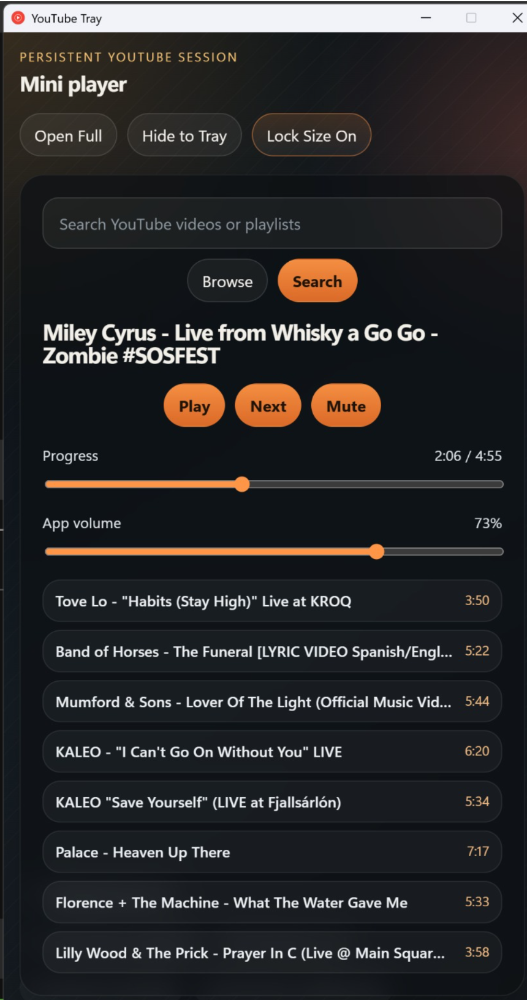
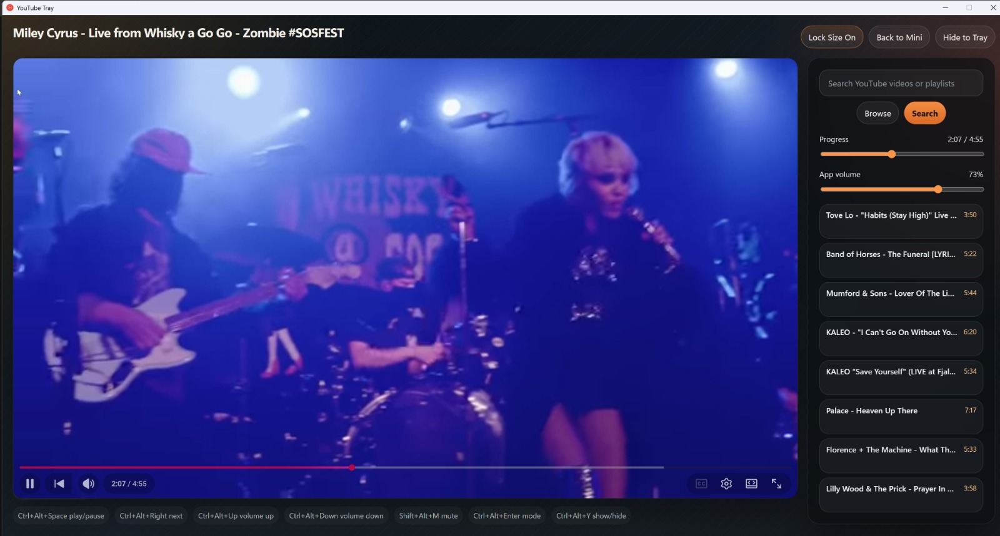

# YouTube Tray

A Windows tray app for people who use YouTube like a music player and want fast, separate controls without hunting for the right browser tab.

## Status

Final.

The desktop shell, launcher, build scripts, packaging configuration, and setup documentation are complete. The app is meant for people who keep YouTube running in the background and want play/pause, next-video, window visibility, queue, seek, and volume control in a dedicated desktop shell.

## Screenshots

Mini player:



Full player:



## Supported Environment

Run and package the app from Windows 10 or Windows 11. WSL, macOS, and Linux are useful for editing files, but the Electron runtime, embedded YouTube view, global shortcuts, tray behavior, and installer flow are Windows-first and should be verified from Windows PowerShell or Command Prompt.

## Current State

- tray integration with close-to-tray behavior and a tray menu
- mini and full player modes
- per-mode size lock and saved window bounds
- persistent YouTube `WebContentsView` with its own preload and profile partition
- React controls mirrored from the live embedded player state
- YouTube search and browse controls
- queue and recommendation list when YouTube exposes one
- play/pause, next, mute, seek, and app volume controls
- native fullscreen handling for the embedded video
- saved playback position and resume on restart
- Windows build, run, launcher, and packaging scripts

## How It Works

Electron owns the native shell: the tray icon, main window, global shortcuts, embedded YouTube view, persistence, and installer configuration.

React renders the mini and full player controls. The renderer talks to Electron through the preload API, while the YouTube preload reads and controls the active YouTube page. The YouTube session is stored in Electron's persistent `youtube-tray` profile partition, so login/session state survives app restarts.

Closing the window hides it to the tray. Use the tray menu's `Quit` action to fully exit the app.

## Requirements

- Windows 10 or Windows 11
- Git
- Node.js 22.12 or newer
- npm, included with Node.js

Install missing tools from PowerShell:

```powershell
winget install --id Git.Git -e
winget install --id OpenJS.NodeJS.LTS -e
```

Close and reopen PowerShell after installing, then check the tools:

```powershell
git --version
node --version
npm --version
```

## Clone and Install

```powershell
git clone https://github.com/zoidypuh/yt-music-client.git
cd yt-music-client
npm install
```

## Development

```powershell
npm run dev
```

`npm run dev` starts the Vite renderer, watches the Electron TypeScript entrypoints, and launches Electron against the local dev server.

## Build and Run

```powershell
npm run build
npm start
```

`npm run build` creates `dist/` and `dist-electron/`. `npm start` runs the built Electron app from `dist-electron/main/index.js`.

For Windows, you can also use the repo-local launcher:

```powershell
.\yt-music-client.cmd
```

That script installs dependencies if `node_modules/` is missing, builds the app, and starts Electron from the repo root.
It starts the long-running Electron process in a hidden background console.

For a fully hidden double-click launcher, use:

```powershell
wscript .\yt-music-client-hidden.vbs
```

That wrapper hides the launcher window itself too. Use `.\yt-music-client.cmd` when you want to see install/build diagnostics.

## Packaging

```powershell
npm run dist
```

This builds the app and creates an NSIS Windows installer in `release/`. The installer artifact is named from the `YouTube Tray` product name and package version `0.1.0`.

## Global Shortcuts

- `Ctrl+Alt+Space` play/pause
- `Ctrl+Alt+Right` next video / recommendation
- `Ctrl+Alt+Up` volume up
- `Ctrl+Alt+Down` volume down
- `Shift+Alt+M` mute
- `Ctrl+Alt+Enter` toggle mini/full
- `Ctrl+Alt+Y` show or hide the window

## Known Limitations

- The app reads YouTube's live DOM, so YouTube markup changes can affect player, queue, or recommendation extraction.
- The queue list may be empty unless the current YouTube page exposes recommendations or playlist items.
- Runtime behavior should be verified natively on Windows. WSL is fine for editing, but it is not the supported runtime environment.

## Notes

- Build outputs live in `dist/` and `dist-electron/`.
- Packaged installers live in `release/`.
